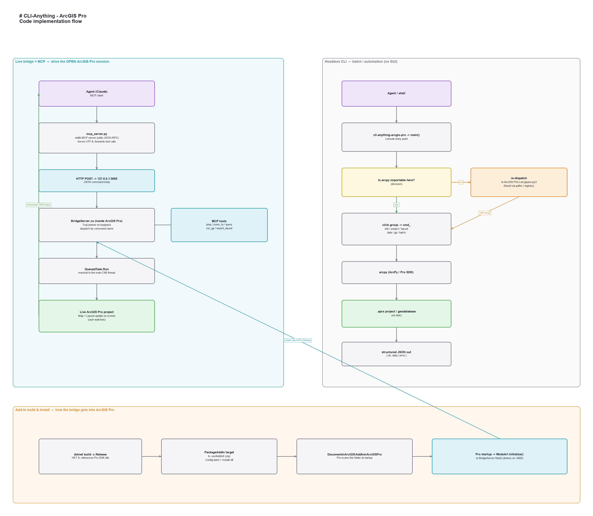

<p align="center">
  
</p>

<h1 align="center">CLI-Anything · ArcGIS Pro</h1>

<p align="center">
  <b>Make ArcGIS Pro agent-native.</b><br>
  An AI agent drives ArcGIS Pro end to end — <i>data → clip → analysis → publication-ready map</i> — and you watch it happen.
</p>

<p align="center">
  <a href="LICENSE"></a>
  <a href="LICENSE-COMMERCIAL.md"></a>
  
  
  
  
  <a href="https://github.com/HKUDS/CLI-Anything/blob/main/public_registry.json"></a>
  <a href="https://glama.ai/mcp/servers/Jasper0122/CLI-Anything-Arcgis-Pro"></a>
  <a href="https://github.com/Jasper0122/CLI-Anything-Arcgis-Pro/stargazers"></a>
</p>

<p align="center">
  <a href="#-demo">Demo</a> ·
  <a href="#-features">Features</a> ·
  <a href="#-quickstart">Quickstart</a> ·
  <a href="#-commands">Commands</a> ·
  <a href="#-mcp-tools">MCP tools</a> ·
  <a href="#-architecture">Architecture</a>
</p>

---

> The **closed-source counterpart** to [CLI-Anything](https://github.com/HKUDS/CLI-Anything)'s QGIS harness. ArcGIS Pro is Esri's commercial GIS desktop app, so it can't be auto-generated from source — this wraps its official **ArcPy / ArcGIS Pro SDK** instead, in two complementary modes:
>
> ✅ **Listed in the official [CLI-Anything registry](https://github.com/HKUDS/CLI-Anything/blob/main/public_registry.json)** ([PR #318](https://github.com/HKUDS/CLI-Anything/pull/318), merged) and on the **[Glama MCP registry](https://glama.ai/mcp/servers/Jasper0122/CLI-Anything-Arcgis-Pro)**.

| Mode | What it drives | How |
|---|---|---|
| **Headless CLI** | `.aprx` projects & geodatabases on disk | `pip` package over `arcpy` |
| **Live bridge + MCP** | the **open** ArcGIS Pro session (you watch it work) | in-process .NET add-in + MCP server |

## ✨ Features

- 🗺️ **Professional cartography** — export layouts and **Map Series / map books** (ArcGIS Pro's edge over QGIS).
- 🧰 **The whole ArcToolbox** — run any geoprocessing tool (buffer, clip, intersect, dissolve, …) via one command.
- 🔌 **Drive the *live* session** — an agent operates the open project over MCP; results appear in the map as you watch.
- 🤖 **Agent-native I/O** — every command speaks JSON: `{ "ok": …, "data" | "error": … }`.
- 🧠 **Self-healing install** — the CLI re-dispatches into ArcGIS Pro's Python automatically, so it works no matter where it's installed.
- ✅ **Tested** — `test_core` (no backend) + `test_full_e2e` (needs ArcGIS Pro).

## 🎬 Demo

A complete workflow driven **live** by an agent — data → clip → analysis → finished map — inside ArcGIS Pro through the MCP bridge:

<video src="https://github.com/user-attachments/assets/c1416209-f2bc-4d14-83a4-0d1f37b8f24c" controls muted width="100%" style="max-height:360px"></video>

## 🚀 Quickstart

Install into ArcGIS Pro's bundled Python (`arcgispro-py3`), which provides ArcPy:

```bat
"C:\Program Files\ArcGIS\Pro\bin\Python\envs\arcgispro-py3\python.exe" -m pip install ^
  git+https://github.com/Jasper0122/CLI-Anything-Arcgis-Pro.git
```

```bat
cli-anything-arcgis-pro --json info
```

> **Installed into a different Python?** (e.g. via the CLI-Hub, which uses its own interpreter.) That's fine — the command **self-dispatches** into ArcGIS Pro's `arcgispro-py3` interpreter when ArcPy isn't present. It locates Pro via common install paths, the `SOFTWARE\ESRI\ArcGISPro` registry key, or the `CLI_ANYTHING_ARCGIS_PYTHON` environment variable.

**Requires** a licensed **ArcGIS Pro** install (provides ArcPy). Verified on ArcGIS Pro 3.4 / ArcPy 3.4.3 / .NET 8.

For the live bridge, build & install the add-in and register the MCP server — see [`live-bridge/README.md`](live-bridge/README.md).

## 🧰 Commands

Headless CLI (every command takes `--json` before the subcommand):

| Command | What it does |
|---|---|
| `info` | ArcPy version, license level, extension availability. |
| `project inspect / layers` | Maps, layouts, layers, data sources of an `.aprx`. |
| `layout list / export / mapseries` | ★ Professional export: layouts + Map Series / map books. |
| `map add-data / symbology graduated / symbology unique` | Author the map: add layers, apply graduated-color / unique-value renderers. |
| `data describe / fields / count / query / calc` | Inspect & edit feature classes and tables. |
| `gp <tool> -a … --kw k=v` | Run **any** geoprocessing tool (the whole ArcToolbox). |
| `batch export-layouts` | Export every layout in a project. |

```bat
:: print-quality A0 map at 300 DPI
cli-anything-arcgis-pro --json layout export C:\proj\city.aprx --layout "Poster" --out C:\out\poster.pdf --dpi 300

:: buffer roads by 100 m
cli-anything-arcgis-pro --json gp analysis.Buffer -a C:\d.gdb\roads -a C:\d.gdb\roads_buf --kw buffer_distance_or_field="100 Meters"

:: close the loop: add the result to a map and symbolize it — no GUI clicks
cli-anything-arcgis-pro --json map add-data C:\proj\city.aprx C:\d.gdb\tracts
cli-anything-arcgis-pro --json map symbology graduated C:\proj\city.aprx tracts --field MEDINCOME --classes 5 --ramp Viridis
```

See [`SKILL.md`](SKILL.md) for the full agent guide, and [`demos/`](demos/) for runnable end-to-end demos.

## 🔌 MCP tools

With the live bridge registered, an agent can drive the **open** project:

| MCP tool | Action on the live project |
|---|---|
| `arcgis_ping` | Read the open project: maps, layouts, active view. |
| `arcgis_zoom_to` | Zoom the active map to a layer (optionally a selection). |
| `arcgis_query` | Query a layer's attributes → structured rows. |
| `arcgis_run_gp` | Run **any** geoprocessing tool; outputs are added to the live map. |
| `arcgis_export_layout` | Export a layout to PDF. |

## 🧭 Architecture

```
Agent ──MCP──► mcp_server.py ──HTTP─► in-Pro add-in ──QueuedTask─► LIVE project
                                                                     (you watch)
```

ArcPy can't attach to a *running* ArcGIS Pro from an external process (Esri limitation). The **live bridge** sidesteps this by running an in-process add-in that exposes the open project over a local socket, wrapped as MCP tools — while the **headless CLI** stays perfect for batch/automation with no GUI.

Full code-implementation flow:



<sub>Source: <a href="docs/implementation-flow.canvas"><code>docs/implementation-flow.canvas</code></a> (JSON Canvas / Obsidian).</sub>

## 📁 Repository layout

```
cli_anything_arcgis_pro/   headless ArcPy CLI (pip package)
tests/                     test_core.py (no backend) + test_full_e2e.py (needs Pro)
demos/                     runnable demos (headless, live bridge, full region workflow)
live-bridge/
  mcp_server.py            stdlib-only MCP server → in-Pro bridge
  ProSimpleMapExport/      ArcGIS Pro .NET add-in (bridge server + export button)
docs/                      hero image, architecture diagram (.png + .canvas)
SKILL.md                   canonical agent skill definition
```

## 🤝 Contributing

This is a standalone harness for [CLI-Anything](https://github.com/HKUDS/CLI-Anything) (listed in its [registry](https://github.com/HKUDS/CLI-Anything/blob/main/public_registry.json), merged in [#318](https://github.com/HKUDS/CLI-Anything/pull/318)). Issues and PRs welcome — run the tests with ArcGIS Pro's Python:

```bat
"C:\Program Files\ArcGIS\Pro\bin\Python\envs\arcgispro-py3\python.exe" -m pytest tests/
```

**Where to help:** see the [**Roadmap**](ROADMAP.md) — it maps every planned command to its ArcPy / Pro SDK API and marks tasks that need **no ArcGIS license** (🐍, e.g. the MCP server, tests, docs) and good first issues (🟢). The biggest open frontier is **cartographic authoring** (symbology, layout, layer management) — the part that makes ArcGIS Pro beat QGIS.

## 📄 License

**Source-available**, not OSI open-source. Licensed under the
[**PolyForm Noncommercial License 1.0.0**](LICENSE):

- 🟢 **Free** for noncommercial use — personal projects, study, research,
  evaluation, and nonprofit / educational / government organizations.
- 💼 **Commercial use requires a paid license** — see
  [`LICENSE-COMMERCIAL.md`](LICENSE-COMMERCIAL.md).

This is an independent downstream project; upstream
[CLI-Anything](https://github.com/HKUDS/CLI-Anything) is separately
licensed under Apache-2.0.

## 🙏 Acknowledgements

Built as a contribution to [HKUDS/CLI-Anything](https://github.com/HKUDS/CLI-Anything) — *"Making ALL Software Agent-Native."* ArcGIS, ArcGIS Pro and ArcPy are trademarks of Esri; this project is an independent integration and is not affiliated with Esri.
